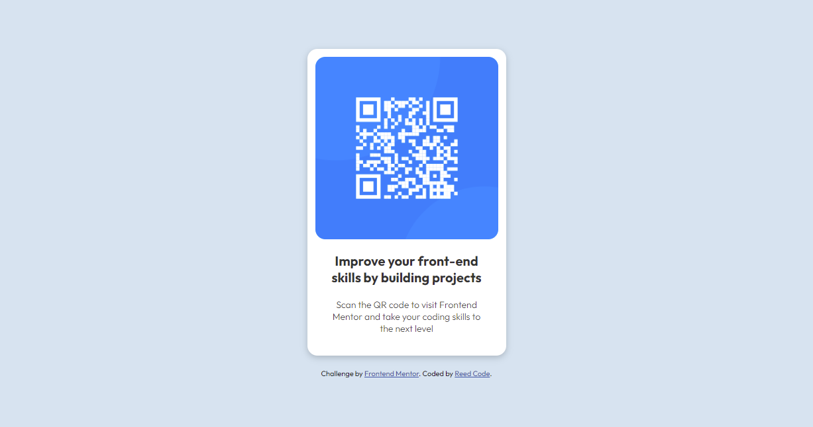

# Frontend Mentor - QR code component solution

This is a solution to the [QR code component challenge on Frontend Mentor](https://www.frontendmentor.io/challenges/qr-code-component-iux_sIO_H). Frontend Mentor challenges help you improve your coding skills by building realistic projects.

## Table of contents

- [Overview](#overview)
  - [Screenshot](#screenshot)
  - [Links](#links)
- [My process](#my-process)
  - [Built with](#built-with)
  - [What I learned](#what-i-learned)
  - [Continued development](#continued-development)
  - [Useful resources](#useful-resources)
- [Author](#author)
- [Acknowledgments](#acknowledgments)

## Overview

This challenge aims to help learners practice and hone their HTML and CSS skills

### Screenshot

### Links

- Solution URL: [Add solution URL here](https://github.com/hsfarid/QR-code-component)
- Live Site URL: [Add live site URL here](https://hsfarid.github.io/QR-code-component/)

## My process

In this project, I used html and css. I first sketched the challenge on a piece of paper and try to visualize and breakdown its layout. Then i wrote the layout in html using semantic tags, wrote the content, and provided the necessary classes. These classes are then used in the css file to style the components of the project.

### Built with

- Semantic HTML5 markup
- CSS custom properties
- CSS Grid

### What I learned

I reinforced my understanding of semantic tags, how to import custom fonts, css grid, layout, and so much more.

### Continued development

I look forward to learning more about creating css styles reusable components.

## Author

- Twitter - [@reed_code](https://www.twitter.com/reed_code)
